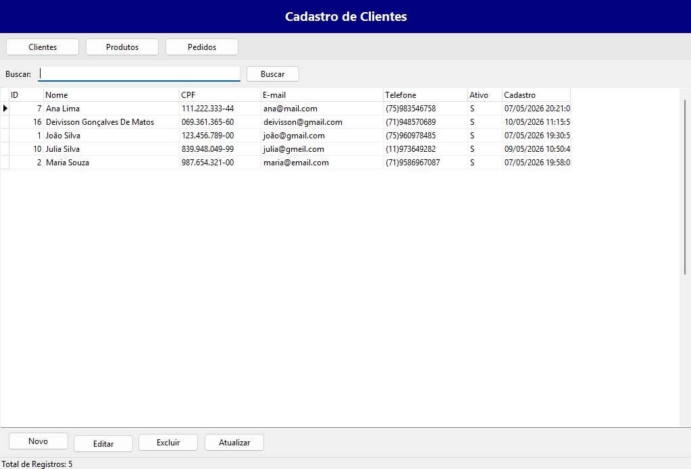
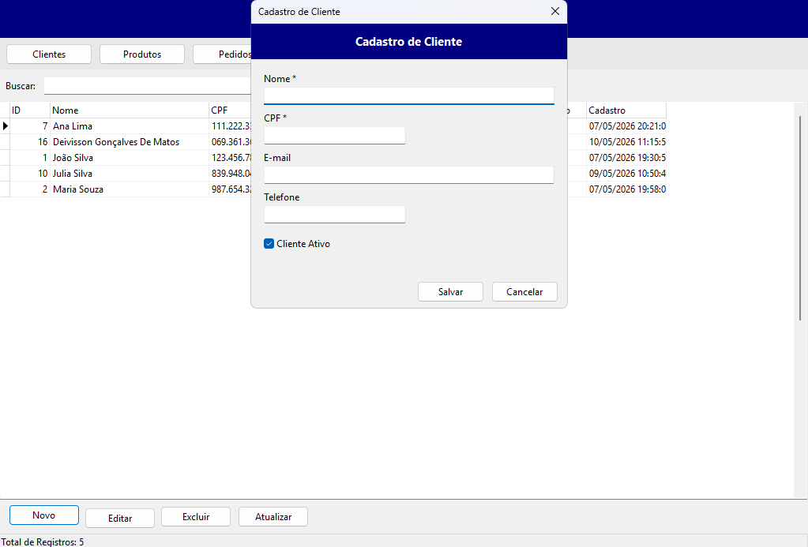
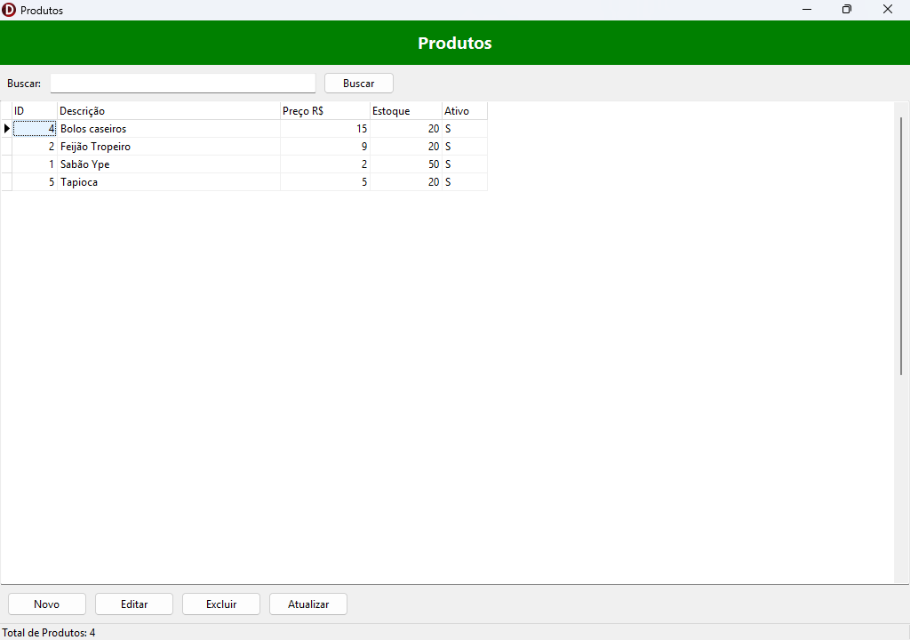
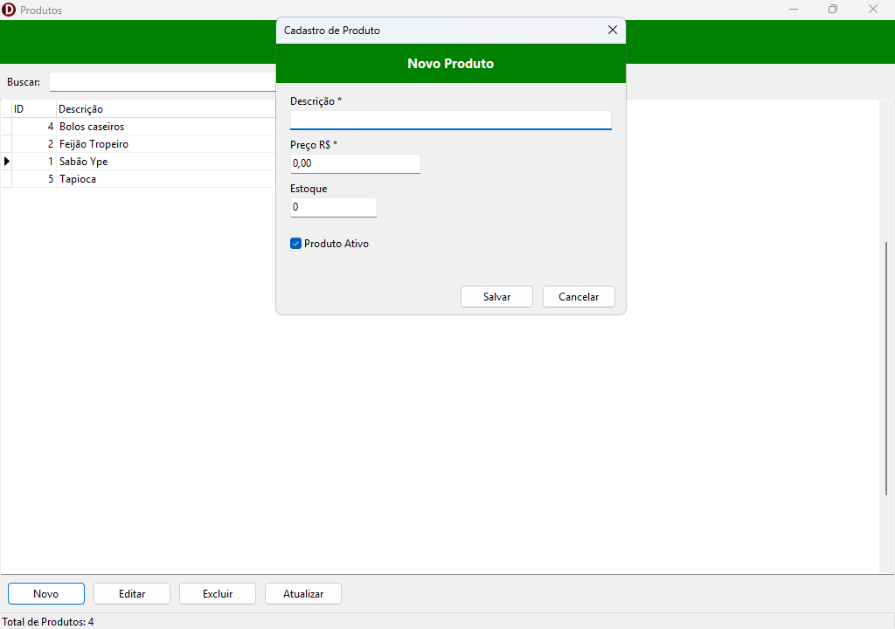
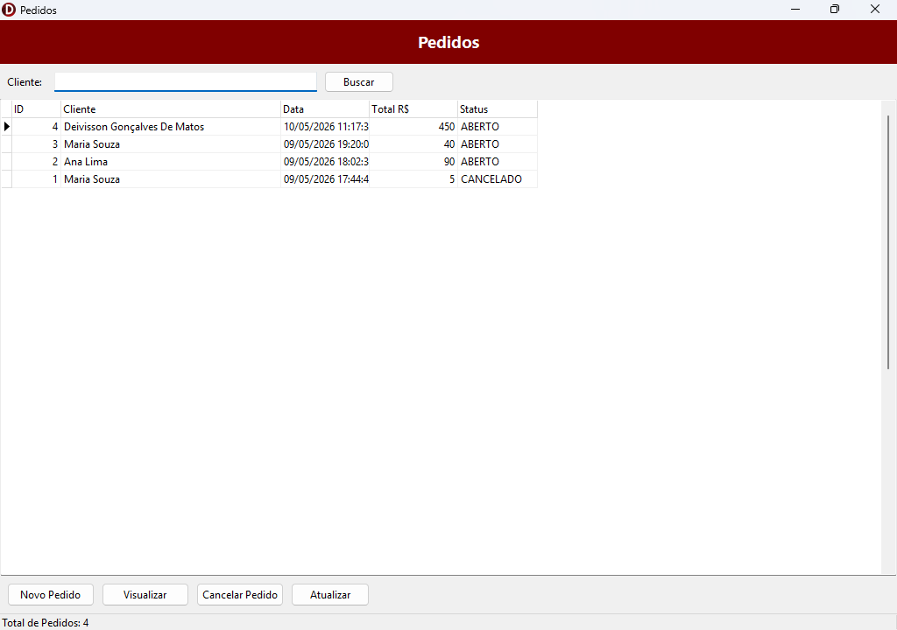
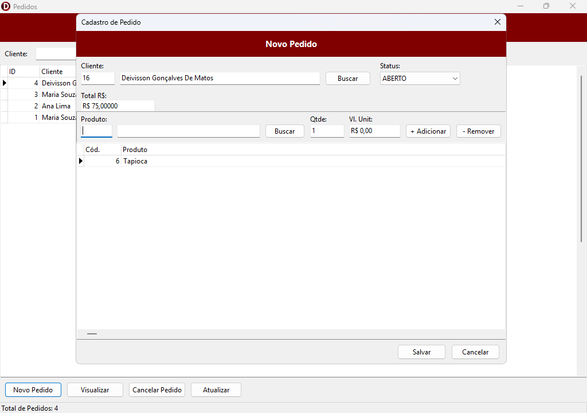

# 🛒 Sistema de Vendas — Delphi + Oracle

> Aplicação desktop desenvolvida em **Delphi (VCL)** com banco de dados **Oracle XE**,
> utilizando conexão direta via **ODAC (Direct Mode)** — sem necessidade de Oracle Client instalado.

---

## 📸 Telas do Sistema

### Tela Principal — Clientes
<!-- Adicione aqui um print da tela principal com o grid de clientes -->


---

### Cadastro de Cliente
<!-- Adicione aqui um print do formulário de cadastro/edição de cliente -->


---

### Gestão de Produtos
<!-- Adicione aqui um print da listagem de produtos -->


---

### Cadastro de Produto
<!-- Adicione aqui um print do formulário de cadastro/edição de produto -->


---

### Gestão de Pedidos
<!-- Adicione aqui um print da listagem de pedidos -->


---

### Cadastro de Pedido (com itens)
<!-- Adicione aqui um print do formulário de pedido com o grid de itens -->


---

## 📋 Funcionalidades

### 👤 Clientes
- Listagem com filtro por nome e CPF em tempo real
- Cadastro com validação de campos obrigatórios (nome, CPF, e-mail, telefone)
- Edição e exclusão (lógica: flag `FL_ATIVO`)
- Status bar com total de registros encontrados

### 📦 Produtos
- Listagem com filtro por descrição
- Cadastro com descrição, preço e controle de estoque
- Alerta automático ao selecionar produto sem estoque no pedido
- Ativação/inativação de produtos

### 🧾 Pedidos
- Listagem de pedidos com filtro por nome do cliente
- Criação de pedido com múltiplos itens
- Adição e remoção de itens com recálculo automático do total (via `SUM` no banco)
- Status do pedido: **ABERTO**, **FATURADO**, **CANCELADO**
- Cancelamento seguro: remove itens e cabeçalho se o pedido não foi salvo
- Valores monetários formatados em **R$ (Real brasileiro)**

---

## 🏗️ Arquitetura do Projeto

```
SistemaDeVendas/
│
├── SistemasVendas.dpr           # Arquivo principal da aplicação
│
├── uDm.pas / uDm.dfm            # DataModule — conexão Oracle e queries centralizadas
│
├── Uprincipal.pas / .dfm        # Tela principal (hub de navegação — Clientes)
│
├── uCadastro.pas / .dfm         # Formulário de cadastro/edição de Cliente
│
├── uProdutos.pas / .dfm         # Listagem de Produtos
├── uCadastroProduto.pas / .dfm  # Formulário de cadastro/edição de Produto
│
├── uPedidos.pas / .dfm          # Listagem de Pedidos
└── uCadastroPedido.pas / .dfm   # Formulário de cadastro de Pedido com itens
```

### Padrão adotado
- **DataModule centralizado** (`TDM`): todas as queries, sessão Oracle e métodos de acesso a dados ficam em `uDm.pas`
- **Forms modais**: cada cadastro é aberto como `ShowModal`, recebendo o ID do registro via `property`
- **Queries dinâmicas**: `TOraQuery` criado em tempo de execução — sem queries ociosas abertas

---

## 🗄️ Banco de Dados — Oracle XE

### Tabelas

| Tabela            | Descrição                          |
|-------------------|------------------------------------|
| `TB_CLIENTE`      | Cadastro de clientes               |
| `TB_PRODUTO`      | Cadastro de produtos e estoque     |
| `TB_PEDIDO`       | Cabeçalho dos pedidos              |
| `TB_ITEM_PEDIDO`  | Itens vinculados a cada pedido     |

### Principais campos

**TB_CLIENTE**
| Campo         | Tipo          | Descrição               |
|---------------|---------------|-------------------------|
| `ID_CLIENTE`  | NUMBER (PK)   | Identificador único     |
| `NM_NOME`     | VARCHAR2      | Nome completo           |
| `NR_CPF`      | VARCHAR2      | CPF                     |
| `DS_EMAIL`    | VARCHAR2      | E-mail                  |
| `NR_TELEFONE` | VARCHAR2      | Telefone                |
| `FL_ATIVO`    | CHAR(1)       | S = ativo / N = inativo |
| `DT_CADASTRO` | DATE          | Data de cadastro        |

**TB_PRODUTO**
| Campo          | Tipo          | Descrição               |
|----------------|---------------|-------------------------|
| `ID_PRODUTO`   | NUMBER (PK)   | Identificador único     |
| `DS_DESCRICAO` | VARCHAR2      | Descrição do produto    |
| `VL_PRECO`     | NUMBER(10,2)  | Preço unitário          |
| `NR_ESTOQUE`   | NUMBER        | Quantidade em estoque   |
| `FL_ATIVO`     | CHAR(1)       | S = ativo / N = inativo |

**TB_PEDIDO**
| Campo        | Tipo          | Descrição                        |
|--------------|---------------|----------------------------------|
| `ID_PEDIDO`  | NUMBER (PK)   | Identificador único (SEQ_PEDIDO) |
| `ID_CLIENTE` | NUMBER (FK)   | Cliente do pedido                |
| `DT_PEDIDO`  | DATE          | Data de emissão                  |
| `DS_STATUS`  | VARCHAR2      | ABERTO / FATURADO / CANCELADO    |
| `VL_TOTAL`   | NUMBER(10,2)  | Total calculado dos itens        |

**TB_ITEM_PEDIDO**
| Campo           | Tipo          | Descrição              |
|-----------------|---------------|------------------------|
| `ID_ITEM`       | NUMBER (PK)   | Identificador único    |
| `ID_PEDIDO`     | NUMBER (FK)   | Pedido pai             |
| `ID_PRODUTO`    | NUMBER (FK)   | Produto                |
| `NR_QUANTIDADE` | NUMBER        | Quantidade             |
| `VL_UNITARIO`   | NUMBER(10,2)  | Valor unitário         |
| `VL_TOTAL`      | NUMBER(10,2)  | Qtde × Vl. Unitário    |

---

## 🛠️ Tecnologias Utilizadas

| Tecnologia    | Versão / Detalhe                          |
|---------------|-------------------------------------------|
| **Delphi**    | 10.x (VCL — Windows Desktop)             |
| **Oracle XE** | 21c (banco local)                        |
| **ODAC**      | Direct Mode — sem Oracle Client          |
| **Componentes** | `TOraSession`, `TOraQuery`, `TOraDataSource`, `TDBGrid` |
| **Linguagem** | Object Pascal                            |

---

## ⚙️ Como Executar

### Pré-requisitos
- Delphi 10.x ou superior instalado
- Oracle XE 21c (ou compatível) rodando localmente
- Biblioteca **ODAC** (UniDAC/ODAC da DevArt) instalada no Delphi

### Configuração da conexão

Em `uDm.pas`, ajuste as credenciais em `ConfigurarConexao`:

```pascal
OraSession.Server   := 'localhost:1521/XE';   // host:porta/service
OraSession.Username := 'seu_usuario';
OraSession.Password := 'sua_senha';
OraSession.Options.Direct := True;            // Direct Mode ativado
```

### Compilar e executar
1. Abra `SistemasVendas.dpr` no Delphi
2. Ajuste as credenciais acima
3. Pressione **F9** para compilar e executar

---

> Projeto desenvolvido para fins de aprendizado e demonstração de habilidades em
> desenvolvimento desktop com Delphi e integração com banco de dados Oracle.
